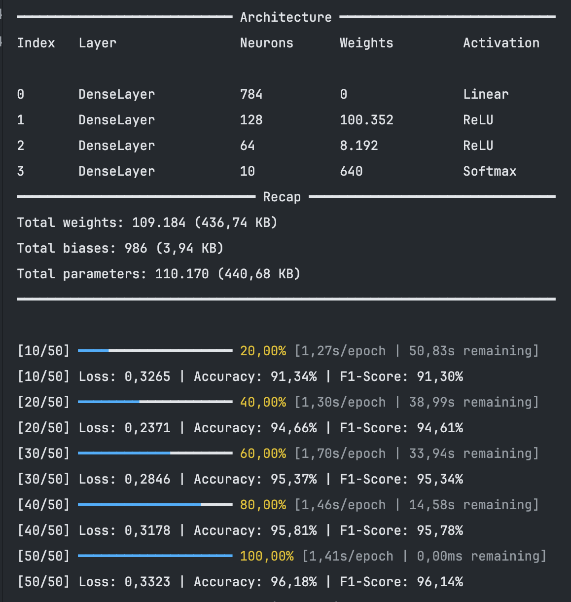
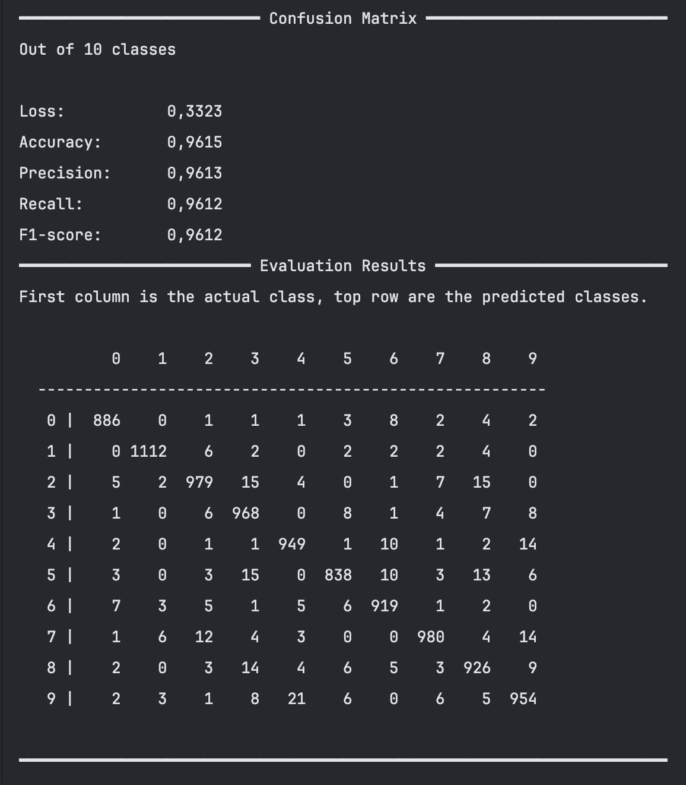

<h1 align="center">
  <br>
  
</h1>

<h4 align="center">A lightweight, performant & open-source machine learning framework for Java.</h4>

<p align="center">
    
    
    
    
</p>

<p align="center">
    <a href="https://brain4j.org">Website</a> •
    <a href="https://github.com/xEcho1337/brain4j/issues/new?template=Blank+issue">Report an Issue</a> •
    <a href="https://github.com/xEcho1337/brain4j/wiki">Documentation</a> •
    <a href="https://github.com/xEcho1337/brain4j/blob/main/CONTRIBUTING.md">Contribute</a>
</p>

Designed with portability and speed in mind, it's optimized for high performance and it's ideal for those looking forward
to implement machine learning solutions in pure Java.

---

## Install

Brain4J is available on [JitPack](https://jitpack.io) and [GitHub Packages](https://github.com/brain4j-org/brain4j/packages).

```groovy
repositories {
    mavenCentral()
    maven { url 'https://jitpack.io' }
}

dependencies {
    implementation 'com.github.brain4j-org.brain4j:brain4j-core:2.9.1'
    implementation 'com.github.brain4j-org.brain4j:brain4j-math:2.9.1'
}
```

See the [installation guide](https://github.com/brain4j-org/brain4j/wiki/Installation) for more information.


## Documentation

All the documentation can be found on the [GitHub Wiki](https://github.com/brain4j-org/brain4j/wiki).

## Preview

Screenshots taken from the MNIST example.

<p align="center">
  
  
</p>

## Contact

This project is maintained by [xEcho1337](https://github.com/xEcho1337).

* Discord: `@xecho1337`
* Telegram: `@xEcho1337`

## License

Brain4J is licensed under [Apache License 2.0](https://github.com/xEcho1337/Brain4J/blob/main/LICENSE)